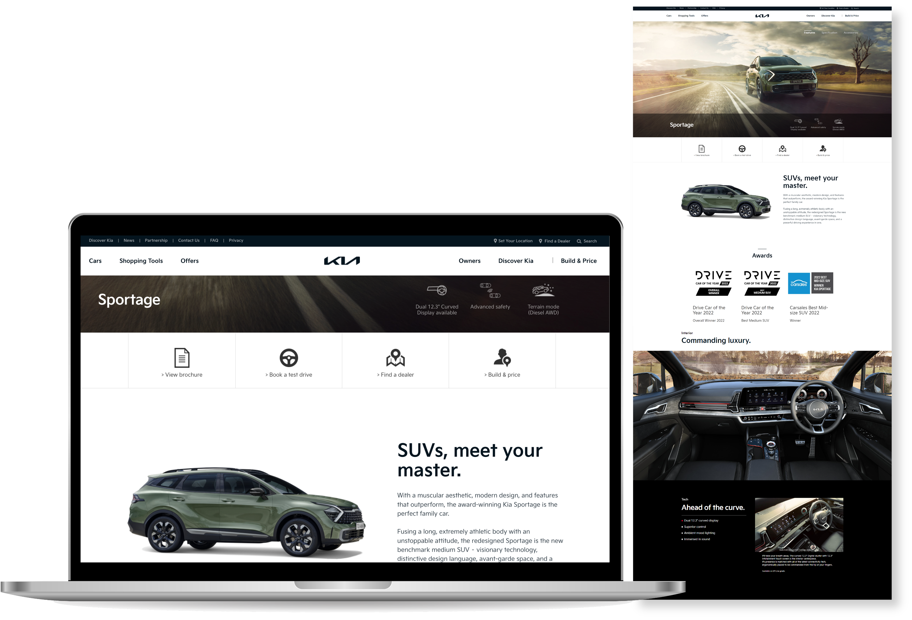

<link rel="stylesheet" href="styles.css" type="text/css">
<link rel="stylesheet" href="site_libs/academicons-1.9.1/css/academicons.min.css"/>

   

## **Kia Product Information Page**

 

[Image] [Kia Australia Sportage](https://www.kia.com/au/cars/sportage/features.html)

  

### **1. Goal**

- Aligned copywriting for Kia websites with the brand voice to develop standardized global copy for launch of new vehicles.

 

### **2. Project Details**

- Studied and filtered through all the materials provided by Kia HQ about the launching models.
- Created copies for main concept, exterior, interior, and unique selling points of each model in line with the brand concept and the vehicle's concept.

 

### **3. Project Results**

- Launched official websites for across over 20 countries.

 

### **4. Deployment**

- Please click [HERE](https://www.kia.com/au/cars/sportage/features.html) and explore Kia Australia Sportage as an example.

 

