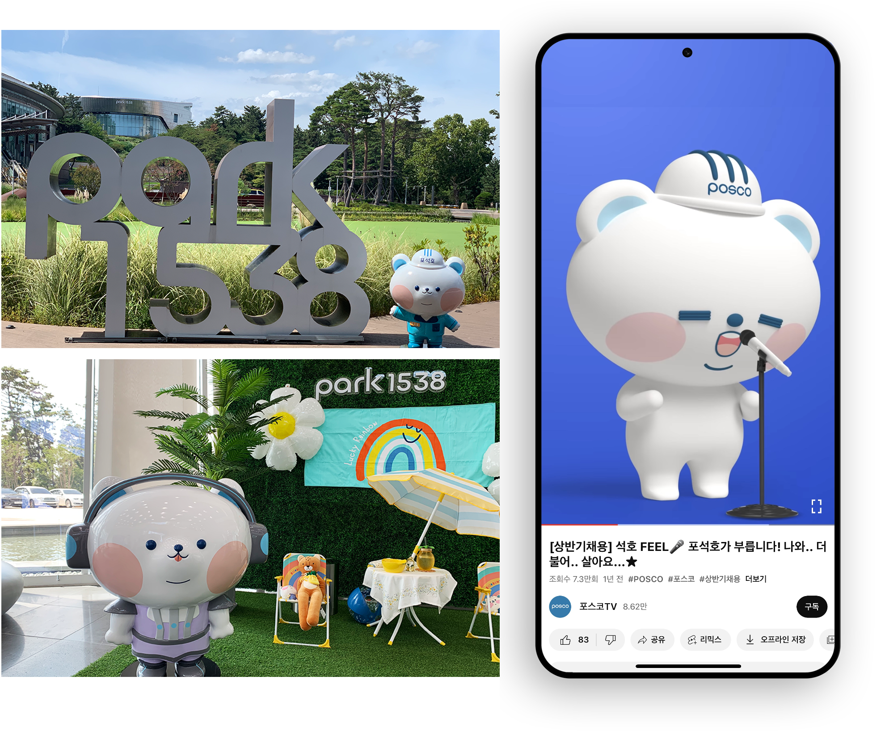

<link rel="stylesheet" href="styles.css" type="text/css">
<link rel="stylesheet" href="site_libs/academicons-1.9.1/css/academicons.min.css"/>

   

## **POSCO 'Po Seok Ho' brand character launch**

  

[Image] [POSCO INSTAGRAM](https://www.instagram.com/hello_posco/?hl=ko)

[Image. left] 'Po Seok Ho’ statues in Park1538, 
POSCO's culture park located in Pohang, Korea

[Image.right] [POSCO Recruiting Shorts](https://www.youtube.com/watch?v=ANh1_OnG0lM)

  

### **1. Goal**

- Successfully targeted Gen Z and improved the image of a B2B steel company by utilising its newly-launched brand character, 'Po Seok Ho’, to enhance communication through social media channels.

 

### **2. Project Details**

- Launched 'Po Seok Ho', POSCO's first official brand character by researching other company's brand characters aligned with the brand's voice.
- As an Instagram channel manager, managed the quality and schedule of 751 pieces of Instagram content using 'Po Seok Ho'.
- Produced YouTube videos and outdoor branding materials collaborating with film productions and partner companies.

 

### **3. Project Results**

- Resulted in a 74% increase in interactions and a 105% increase in followers on Instagram YoY.
- Selected as Winner of Golden World Awards 2022 in the Social Media Category Held by the International Public Relations Association. [HERE](https://newsroom.posco.com/en/posco-was-selected-as-winner-of-golden-world-awards-2022-in-the-social-media-category-held-by-the-international-public-relations-association/)
- Received 2021 Gold Steve Awards for innovation in the use of social media. [HERE](https://www.asia.stevieawards.com/node/1243)

 

### **4. Deployment**

- Please click [POSCO INSTAGRAM](https://www.instagram.com/hello_posco/?hl=ko) , [POSCO YOUTUBE](https://www.youtube.com/channel/UCGu-RtRyCaWQl32YoOh4WNg) and explore 'Po Seok Ho's stories with POSCO

 

