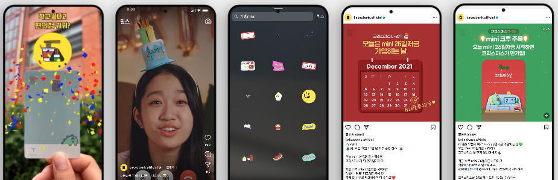

<link rel="stylesheet" href="styles.css" type="text/css">
<link rel="stylesheet" href="site_libs/academicons-1.9.1/css/academicons.min.css"/>

   

## **Kakaobank Mini card Campaign**

  

[Image] [KAKAOBANK INSTAGRAM](https://www.instagram.com/kakaobank.official/)

[Image] ['mini card’Instagram AR filter](https://www.instagram.com/p/CgB7KB2hq2L/)

[Image] ['mini card’Instagram Reels](https://www.instagram.com/reel/CkIEIC7hV4N/)

[Image] 'mini card’Instagram Story Stickers

[Image] ['mini card’Instagram Campaign 2021 ](https://www.instagram.com/p/CW5GmpkPZie/)

[Image] ['mini card’Instagram Campaign 2022 ](https://www.instagram.com/p/CljJSG4JytZ/)

  

### **1. Goal**

- Promoted ‘mini card’ targeting teenagers through social media campaigns.

 

### **2. Project Details**

- Produced mini card promotion videos, 10 pieces of Instagram content, AR filters, and Instagram story stickers with designers and directors.
- Monitored and analyzed performance of campaign ad performance using Excel and data sourced from Meta and Instagram.

 

### **3. Project Results**

- Achieved a 76% increase in event participants from 2021 to 2022 on the 'mini card' campaign targeting teenagers.

 

### **4. Deployment**

- Please click [KAKAOBANK INSTAGRAM](https://www.instagram.com/kakaobank.official/) and explore Kakaobank's latest stories.

 

