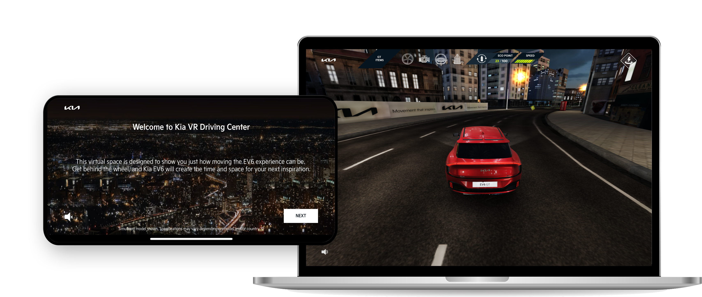

<link rel="stylesheet" href="styles.css" type="text/css">
<link rel="stylesheet" href="site_libs/academicons-1.9.1/css/academicons.min.css"/>

   

## **KIA EV6 Driving Centre Development**

  

[Image] [Kia EV6 Driving Centre](https://worldwide.kia.com/int/VR-driving-center/index.html#/intro)

  

### **1. Goal**

- Increased awareness of both Kia's brand and first electric vehicle, EV6, by creating personalized digital test drive experience that complements physical test drives. 

 

### **2. Project Details**

- Developed concepts and devised content for the personalized digital test drive cooperating with developers and web designers
- Created global versions for 10 countries to effectively communicate and translate the benefits and features of the EV6.

 

### **3. Project Results**

- Utilized online test drive experience in offline motor show in the Philippines
- Received the [2021 SABRE Award](https://worldwide.kia.com/int/VR-driving-center/index.html#/intro) in the Global Campaign and Digital Platform categories.

 

### **4. Deployment**

- Please click [HERE](https://worldwide.kia.com/int/VR-driving-center/index.html#/intro) and explore KIA EV6 Driving Centre.

 

