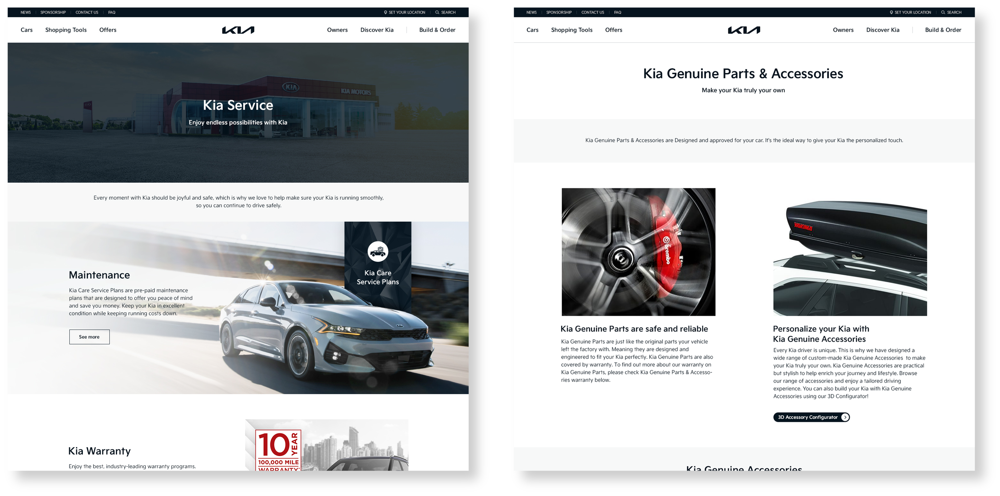

<link rel="stylesheet" href="styles.css" type="text/css">
<link rel="stylesheet" href="site_libs/academicons-1.9.1/css/academicons.min.css"/>

   

## **KIA Worldwide Content Management**

  

[Image. Kia Owners Website Global Standard Template]

  

### **1. Goal**

- Established a global standard template for the Kia Owners website to provide guidance to Kia in all regions.

 

### **2. Project Details**

- Researched and benchmarked over 6 competitors’ owners' service offerings.
- Collaborated with developers and designers to create user flows, wireframes, site maps and mockups for owners' service and parts of Kia's online store page.

 

### **3. Project Results**

- Successfully launched a pilot website with Kia Singapore.

 

