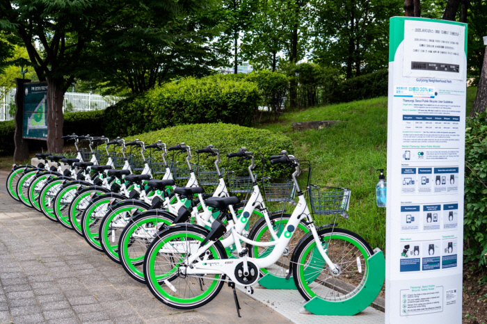
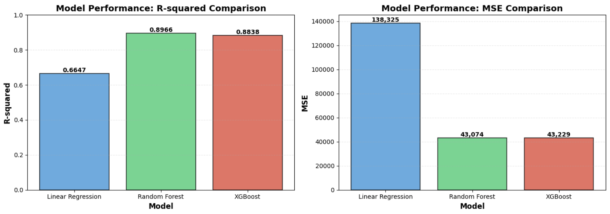

<link rel="stylesheet" href="styles.css" type="text/css">
<link rel="stylesheet" href="site_libs/academicons-1.9.1/css/academicons.min.css"/>

   

## **Predicting Hourly Bike Rental Demand Using Regression/ML**

  

   

### **1. Figure**

  

  

### **2. Goal**

+ Built a **predictive regression model** to forecast **hourly bike rental demand** for Seoul’s public bike-sharing system.  
+ Applied **machine learning algorithms** to identify key demand drivers and **optimise operational efficiency**.  
+ Supported **data-driven decision-making** in bike redistribution and resource management.  

 

### **3. Methodology & Summary**

- **Data:** Utilised the *Seoul Bike Sharing Demand* dataset from the UCI Machine Learning Repository, containing 8 weather and time-related features (e.g., temperature, windspeed, season, holiday, etc.) and hourly rental counts collected from Dec 2017 – Nov 2018.  
- **EDA:** Identified strong seasonal and hourly trends — rental peaks during commuting hours and warmer months. Minimal missing data ensured high-quality model input.  
- **Feature Engineering: Created temporal features (hour, day of week, month, holiday) and weather-based categories (temperature and humidity ranges) to enhance model interpretability and predictive accuracy.  
- **Modelling & Evaluation: Trained and compared **Linear Regression (R² = 0.66)**, **Random Forest (R² = 0.90)**, and **XGBoost (R² = 0.88)** using **cross-validation** for robust performance evaluation.  
  The **Random Forest model** achieved the highest **R² (89.6%)** and lowest **MSE**, effectively capturing **non-linear** feature interactions compared with Linear Regression or XGBoost.  
  Results indicate that temperature, hour of day, and humidity were the most significant predictors, supporting machine learning–driven demand forecasting for **optimising** public bike operations.

 

### **4. Code**

Please click **[HERE (nbviewer)](https://nbviewer.org/github/CassieGayounChoi/cassiegayounchoi.github.io/blob/main/files/Predicting%20Hourly%20Bike%20Rental%20Demand%20for%20Seoul%20Public%20Bike-Sharing%20Service.ipynb)** for the analysis report and code, or view it **[on GitHub](https://github.com/CassieGayounChoi/cassiegayounchoi.github.io/blob/main/files/Predicting%20Hourly%20Bike%20Rental%20Demand%20for%20Seoul%20Public%20Bike-Sharing%20Service.ipynb)**.

 
